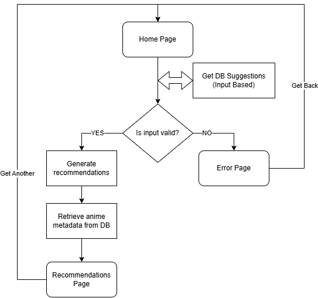
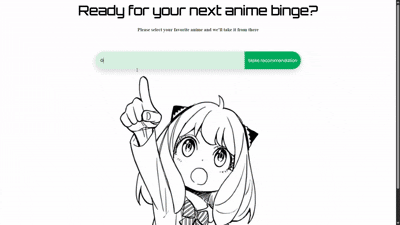

# Anime Recommendation System
An interactive website that lets users discover new anime.

## Technologies:
- Flask
- Bootstrap
- HTMX
- SQLite
- TF-IDF
- Lemmatization
- Cosine Similarity
- Scikit-learn

## Features:
- content-based recommendations;
- autocomplete suggestions from the database;
- interactive recommendation cards;
- fast inference using a pre-trained TF-IDF matrix;
- [hosted on Render.](https://anime-recommendation-system-rxng.onrender.com/)

## Dataset:
The dataset used for training can be found here: [AniList Anime Dataset](https://www.kaggle.com/datasets/calebmwelsh/anilist-anime-dataset)

Data preparation steps:
- selecting relevant columns;
- format cleaning;
- filtering results;
- handling missing data.

## Model logic:
Preprocessing: each anime description is first lemmatized, after which a TF-IDF matrix is generated.
After the anime is chosen the cosine similarity is computed between that anime and all others.
Finally, the get_recommendations function will return a list of 10 anime titles ranked by similarity score.

Before deployment, the recommendation model is trained and saved as model.pkl. This allows the application to load the pre-trained model at runtime and generate recommendations instantly, without needing to retrain each time.

## System Flow:

## Demo:

The main goal of this project was to explore how frontend, backend, machine learning, and database components come together in an end-to-end project.
